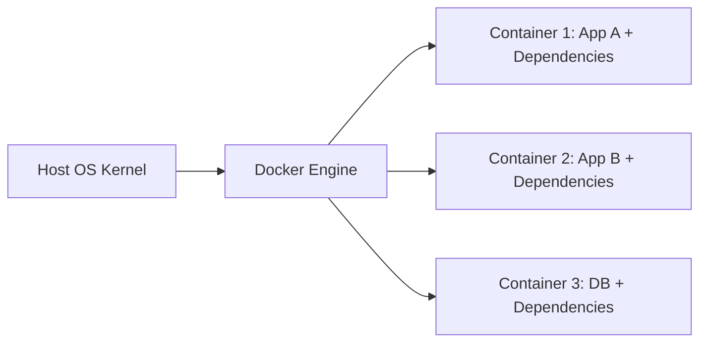
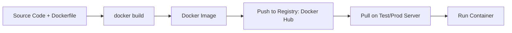

# Docker Overview (Beginner Friendly)

## 1) Why do we need Docker?

Imagine this story:

- A developer builds a Node.js app on their laptop.
- It works perfectly there.
- They share it with QA.
- QA says: "It is not running on my machine."
- Production team says: "It needs a different library version."

This is the classic dependency problem ("works on my machine").

Docker solves this by packing:

- the app
- runtime (example: Node, Python, Java)
- libraries/dependencies
- required config

into one portable unit, so the same app runs the same way everywhere.

### Without Docker (Dependency Matrix Problem)

```text
Developer Machine (Node 20, Library A v3) -> Works
QA Machine (Node 18, Library A v2) -> Fails
Server (Node 16, missing package) -> Fails
```

### With Docker

```text
Docker Image (App + Node 20 + Library A v3)
        -> Developer runs
        -> QA runs
        -> Server runs
Result: Same behavior in all environments
```

## 2) What can I do with Docker?

With Docker, you can:

- Build an app once and run it anywhere.
- Run multiple apps in isolated containers on one machine.
- Quickly start tools like databases (`MySQL`, `PostgreSQL`, `Redis`) for local development.
- Share your app as an image with your team.
- Deploy the same image in testing and production.

Simple example:

```bash
docker run -d -p 8080:80 nginx
```

This runs an Nginx web server in a container and maps it to your machine's port `8080`.

## 3) What are containers?

A container is a lightweight package that includes:

- application code
- dependencies
- runtime

and runs in isolation from other containers.

Easy analogy:

- VM is like renting a full house.
- Container is like renting a room in a shared building.

Rooms are faster and lighter than full houses.



## 4) Operating System and Docker (Kernel Concept)

### What is a kernel?

The kernel is the core of an operating system.  
It manages CPU, memory, storage, and processes.

Containers do not carry a full OS.  
They share the host system's kernel.

### How Docker uses the kernel

- On **Linux**: Docker containers use the Linux host kernel directly.
- On **Windows/macOS**: Linux containers run using a lightweight Linux VM (through Docker Desktop), because Linux containers need a Linux kernel.

```text
Linux Host -> Docker Engine -> Linux Containers (direct kernel sharing)
Windows/macOS Host -> Docker Desktop -> Lightweight Linux VM -> Linux Containers
```

## 5) Docker Containers vs Virtual Machines

| Feature | Containers | Virtual Machines |
|---|---|---|
| Includes full OS? | No | Yes |
| Startup time | Seconds | Minutes |
| Size | Small (MBs) | Large (GBs) |
| Performance overhead | Low | Higher |
| Isolation level | Process-level | Hardware-level |

### Beginner story

You are building an e-commerce app with:

- frontend
- backend
- database

If you use VMs for each service, setup is heavy and slow.  
If you use containers, each service starts quickly and is easy to move between environments.

Containers are preferred for microservices, CI/CD pipelines, and fast scaling.

## 6) How Docker works (Images and Repository)

Docker workflow:

1. Write a `Dockerfile`.
2. Build an image from it.
3. Store/push image to a Docker registry (example: Docker Hub).
4. Pull the same image anywhere.
5. Run it as a container.



Example commands:

```bash
docker build -t myapp:1.0 .
docker tag myapp:1.0 yourname/myapp:1.0
docker push yourname/myapp:1.0
docker run -p 8080:8080 yourname/myapp:1.0
```

## 7) Docker in DevOps (Developer + Operations Story)

### Team scenario

- Developer writes code and updates `Dockerfile`.
- CI pipeline builds a Docker image and runs tests.
- Image is pushed to a registry.
- Operations team deploys the same image to staging and production.

No "it worked on dev only" issue, because everyone uses the same image.


### Why DevOps teams like Docker

- Consistent deployments
- Faster release cycles
- Easy rollback with image tags
- Better collaboration between developers and operations


### Docker installation 
- Follow [Docker documentation](https://docs.docker.com/get-docker/) to install Docker on your machine.

- Add the installation steps  for ubuntu and mac 