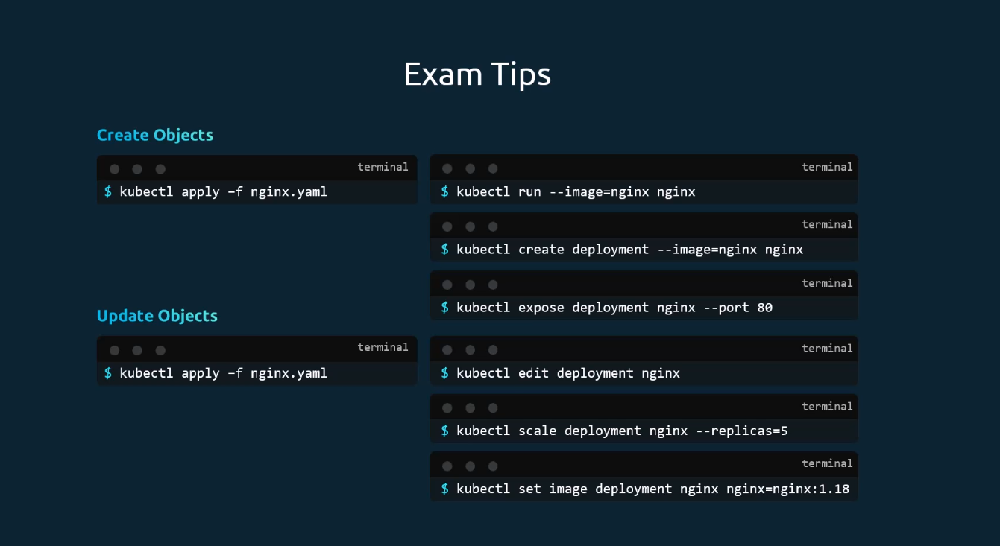

# Kubernetes Core concepts -Part 2

## Table of Contents
- <a href="#pods">Pods</a>
- <a href="#pods---replication">Pods - Replication</a>
- <a href="#deployments">Deployments</a>
- <a href="#services">Services</a>

### Topic
Deployments, ReplicaSets, Pods, and kubectl shorthand commands

## Pods
- Containers are encapsulated in a deployable object called **Pods**
- In Kubernetes, the hierarchy is: Cluster → Node → Pod (Pod is the smallest deployable unit)
- Two applications can run in two different pods
- Pods have a 1:1 relationship with containers — to scale up, you create more pods
- We can create multi-container pods — two or more containers (helper containers) in a single pod


### Usage of Pods - A Scenario-Based Example

- Consider a Docker Python application with a helper container. Previously, you would need to run two separate commands:
```
docker run python-app
docker run helper --link app1
```

- When using **Pods**, Kubernetes handles the container linking automatically. When you run a pod, two containers are spawned together. This removes the need to run helper and main app separately. Pods encapsulate the image, network, and volumes in a single unit. 


### Deploy a Pod

```bash
kubectl run nginx --image nginx
```

- Get pods — initially will be in `Pending` state, then transform to `Running` state

```bash
kubectl get pods
```


### Pods with YAML

- Example pod manifest (`pod-definition.yaml`):

```yaml
apiVersion: v1
kind: Pod
metadata:
  name: myapp-pod
  labels:
    app: myapp
    tier: frontend
spec:
  containers:
    - name: nginx-container
      image: nginx:latest
      ports:
        - containerPort: 80
```

- `apiVersion`: API version for this resource type (`v1` for Pod).
- `kind`: Kubernetes object type (`Pod`).
- `metadata`: Identifying data such as name and labels.
- `spec`: Desired state of the pod, including container definitions.

### Kubectl commands
Generate a pod YAML quickly using dry-run (client-side only):

```bash
kubectl run myapp-pod \
  --image=nginx:latest \
  --dry-run=client -o yaml > pod-definition.yaml
```

Create or update the pod from the manifest:

```bash
kubectl apply -f pod-definition.yaml
```

Check pod status:

```bash
kubectl get pods
```

View detailed pod information:

```bash
kubectl describe pod myapp-pod
```

Why `kubectl edit` is important:

- If you edit the local YAML and run `kubectl create -f ...` again, you may accidentally create a new pod (for example, after changing `metadata.name`), which means another container is started.
- `kubectl edit pod <pod-name>` updates the existing live object instead of creating a second pod.

Example:

```bash
# Existing pod
kubectl get pods
# myapp-pod   1/1   Running

# Risky flow: change name in YAML to myapp-pod-v2, then create again
kubectl create -f pod-definition.yaml
kubectl get pods
# myapp-pod      1/1   Running
# myapp-pod-v2   1/1   Running   <-- extra pod/container created
```

Safer update flow:

```bash
# Edit the running pod directly
kubectl edit pod myapp-pod
```

- For file-based changes, prefer `kubectl apply -f pod-definition.yaml` instead of running `create` repeatedly.

Run/restart example (standalone Pod):

```bash
# Re-apply config (create if missing, update if exists)
kubectl apply -f pod-definition.yaml

# If you need a clean restart for a standalone pod
kubectl delete pod myapp-pod
kubectl apply -f pod-definition.yaml
```

## Pods - Replication

Replication means running multiple copies of the same Pod so your app stays available and can handle more traffic.

- If one Pod fails, Kubernetes creates a new one (self-healing).
- If traffic increases, you can increase the number of replicas (scaling).
- For modern workloads, use **ReplicaSet** (usually managed by a **Deployment**).
- **ReplicationController** is older and kept here for basics/legacy understanding.

### Option 1: ReplicationController (Legacy)

```yaml
apiVersion: v1
kind: ReplicationController
metadata:
  name: myapp-rc
spec:
  replicas: 3
  selector:
    app: myapp
    tier: frontend
  template:
    metadata:
      labels:
        app: myapp
        tier: frontend
    spec:
      containers:
        - name: nginx-container
          image: nginx:latest
          ports:
            - containerPort: 80
```

### Option 2: ReplicaSet (Recommended over RC)

```yaml
apiVersion: apps/v1
kind: ReplicaSet
metadata:
  name: myapp-rs
spec:
  replicas: 3
  selector:
    matchLabels:
      app: myapp
      tier: frontend
  template:
    metadata:
      labels:
        app: myapp
        tier: frontend
    spec:
      containers:
        - name: nginx-container
          image: nginx:latest
          ports:
            - containerPort: 80
```

### Labels and Selectors (Important)

- Labels are key-value tags on Pods.
- Selectors tell RC/RS which Pods they should manage.
- The labels in `template.metadata.labels` must match the selector.

### Common Commands (Organized)

```bash
# 1) Create resources
kubectl apply -f replication-controller.yaml
kubectl apply -f replicaset.yaml

# 2) List resources
kubectl get rc
kubectl get rs
kubectl get pods

# 3) Inspect details
kubectl describe rc myapp-rc
kubectl describe rs myapp-rs

# 4) Scale replicas
kubectl scale --replicas=5 -f replicaset.yaml
kubectl scale --replicas=5 rs myapp-rs

# 5) Delete resources
kubectl delete -f replication-controller.yaml
kubectl delete -f replicaset.yaml
```

### Quick Note

In real projects, you usually create a **Deployment**, and Deployment manages the ReplicaSet for you.

## Deployments

- A higher-level abstraction that manages ReplicaSets and Pods.
- Provides declarative updates, rollbacks, and scaling.

- It acts as the top layer for the replcaset and pod management. You create a deployment, and it creates the ReplicaSet, which in turn creates the Pods.

- The syntax is more similar to ReplicaSet, but with `kind: Deployment` and `apiVersion: apps/v1`.

```yaml
apiVersion: apps/v1
kind: Deployment
metadata:
  name: myapp-deployment
spec:
  replicas: 3
  selector:
    matchLabels:
      app: myapp
      tier: frontend
  template:
    metadata:
      labels:
        app: myapp
        tier: frontend
    spec:
      containers:
        - name: nginx-container
          image: nginx:latest
          ports:
            - containerPort: 80
```

Commands
```bash
# Create deployment
kubectl apply -f deployment.yaml  

#List deployments
kubectl get deployments

# Describe deployment
kubectl describe deployment myapp-deployment

# GET all the info
kubectl get all
```

- The below commands are shorthands that can be used without first creating a YAML file.

```bash
# Create an NGINX Pod
kubectl run nginx --image=nginx

# Generate a Pod manifest YAML file without creating the pod
kubectl run nginx --image=nginx --dry-run=client -o yaml

# Create a Deployment directly
kubectl create deployment nginx --image=nginx

# Generate a Deployment YAML manifest without creating it
kubectl create deployment nginx --image=nginx --dry-run=client -o yaml

# Generate a Deployment YAML and save it to a file
kubectl create deployment nginx --image=nginx --dry-run=client -o yaml > nginx-deployment.yaml

# Create the Deployment from the saved YAML after editing it
kubectl create -f nginx-deployment.yaml

# In Kubernetes 1.19+, create a deployment with 4 replicas using dry-run to generate YAML
kubectl create deployment nginx --image=nginx --replicas=4 --dry-run=client -o yaml > nginx-deployment.yaml
```

## Services

- A Service is an abstraction that defines a logical set of Pods and a policy by which to access them.
- Enables the communication between different components of an application and with the outside world.
- It is object like pods/deploymnents but it is not a workload, it is a service that provides access to the workloads (pods).

Scenario: You have a frontend application that needs to communicate with a backend service. The frontend can use a Service to discover and connect to the backend Pods without needing to know their IP addresses.


### Types of Services
#### NodePort:
- Exposes the service on a static port on each node's IP. Accessible from outside the cluster using `<NodeIP>:<NodePort>`.

- example: Application hosted on the port 80 inside the cluster, but exposed on port 30007 on each node.

- Range of the node port is 30000-32767, and you can specify any port in that range. Kubernetes will route traffic from that port to the target port on the pods.

```yaml
apiVersion: v1
kind: Service
metadata:
  name: myapp-service
spec:
  type: NodePort
  selector:
    app: myapp
    type: frontend
  ports:
    - targetPort: 80
      port: 80
      nodePort: 30007
```

Commands:
```bash
# Create a NodePort service
kubectl apply -f nodeport-service.yaml  

# Get services
kubectl get services

```

- This service works on single pod - single node, Multiple pods - single node, and multiple pods - multiple nodes scenarios. It is a simple way to expose your application to the outside world, but it has limitations in terms of scalability and load balancing.

#### ClusterIP: 
- Exposes the service on a cluster-internal IP. This is the default type. It makes the service only reachable from within the cluster.

- Since the Internal communication between the frontend and backend services cannot rely on the external IPs, we use ClusterIP to allow them to communicate within the cluster.

```yaml
apiVersion: v1
kind: Service
metadata:
  name: myapp-backend-service
spec:
  type: ClusterIP
  selector:
    app: myapp
    type: backend
  ports:
    - targetPort: 80
      port: 80
```

- Use the same service commands to create and manage ClusterIP services as well.

#### LoadBalancer:
- Exposes the service externally using a cloud provider's load balancer. This is typically used in cloud environments where you want to expose your service to the internet.

- When we hosted the application across node, we require the IP for the seperate node to access the application, but with LoadBalancer service, we can get a single external IP that load balances traffic to all the nodes hosting the application.

```yaml
apiVersion: v1
kind: Service
metadata:
  name: myapp-loadbalancer-service
spec:
  type: LoadBalancer
  selector:
    app: myapp 
    type: frontend
  ports:
    - targetPort: 80
      port: 80
```

## Namespaces
- Namespaces are a way to divide cluster resources between multiple users (via resource quota).
- They provide a scope for names. Names of resources need to be unique within a namespace, but not across namespaces.
- Useful for organizing resources in a cluster, especially in larger environments with multiple teams or projects.

 - By default, Kubernetes creates a `default` namespace for you. You can create additional namespaces as needed.

```bash
# Create a new namespace
kubectl create namespace my-namespace 
```

- Can define the policy on the resource utilization.

- Essential commands
```bash
# List namespaces
kubectl get namespaces

# List pods in a specific namespace
kubectl get pods -n my-namespace

# List all the pods across all namespaces
kubectl get pods --all-namespaces

# Set the default namespace for the current context
kubectl config set-context --current --namespace=my-namespace
```

- In addition the namespace can be defined in the YAML file as well, and it will be created in that namespace.

```YAML
apiVersion: v1
kind: Pod
metadata:
  name: myapp-pod
  namespace: my-namespace
  ...

```

**Note**: The communication within the namespace is allowed and names can be referred to without the namespace, but for cross-namespace communication, you need to specify the namespace in the service name (e.g., `my-service.my-namespace.svc.cluster.local`).

## Imperative vs Declarative
- Imperative: You tell Kubernetes what to do (e.g., `kubectl run nginx --image=nginx`).
- Declarative: You define the desired state in a YAML file and apply it (e.g., `kubectl apply -f deployment.yaml`).
- Declarative is generally recommended for better version control and reproducibility, while imperative can be useful for quick testing or one-off tasks.



