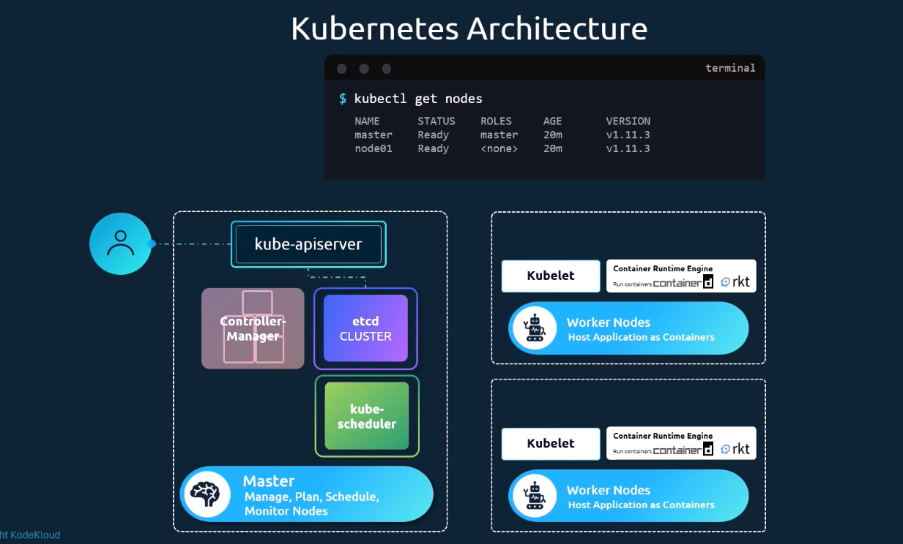
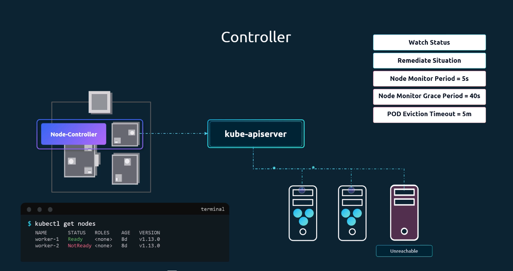

# Kubernetes Core Concepts

> **Quick Navigation**: Click any topic below to jump directly to that section.

## Table of Contents

### Architecture & Basics
- [Cluster Architecture](#cluster-architecture) - Control plane + worker node model
- [Quick Analogy](#quick-analogy-dock-and-cargo-ships) - Memory aid
- [Docker vs Containerd](#docker-vs-containerd) - Runtime differences
- [Runtime CLI Tools](#runtime-cli-tools) - ctr, nerdctl, crictl

### Storage & State
- [etcd](#etcd) - Distributed key-value store
- [etcd in Kubernetes Deployments](#etcd-in-kubernetes-deployments) - Deployment modes

### Control Plane Components
- [Kubernetes Architecture](#kubernetes-architecture) - API Server overview
- [Kube API Server](#kube-api-server) - Entry point for cluster operations
- [Kube Scheduler](#kube-scheduler) - Pod assignment to nodes
- [Kube Controller Manager](#kube-controller-manager) - Reconciliation loops

### Worker Node Components
- [Kubelet](#kubelet) - Node agent managing containers
- [Kube-Proxy](#kube-proxy) - Service networking and routing

---

## Cluster Architecture

Kubernetes follows a control plane + worker node model.

### Control Plane Components

- `kube-apiserver`: Entry point for all cluster operations.
- `etcd`: Distributed key-value store for cluster state and metadata.
- `kube-scheduler`: Assigns Pods to worker nodes.
- `kube-controller-manager`: Runs controllers (for node health, replicas, endpoints, etc.).

### Worker Node Components

- `kubelet`: Node agent that talks to the API server and manages Pods on the node.
- `kube-proxy`: Handles Service networking and Pod traffic routing rules.
- `containerd` (or another CRI runtime): Runs containers.

## Quick Analogy (Dock and Cargo Ships)

Use this only as a memory aid:

- Control plane: Dock operations center (plans, schedules, monitors).
- Worker nodes: Cargo ships carrying workloads (Pods/containers).
- `etcd`: Cargo manifest database.
- `kube-scheduler`: Decides which ship carries which cargo.
- Node controller: Monitors ship health and reports status.
- `kube-apiserver`: Communication and control channel.
- `kubelet`: Captain on each ship executing instructions.
- `kube-proxy`: Network routing between ships and services.

## Docker vs Containerd

- Docker is a full container platform.
- Kubernetes is a container orchestration system.
- Kubernetes now talks to runtimes through the **Container Runtime Interface (CRI)**.

### Why CRI Matters

Earlier Kubernetes relied on Docker integration. With CRI, Kubernetes supports multiple runtimes such as:

- `containerd`
- `CRI-O`
- (historically) `rkt`

### OCI Standards

Container runtimes and images follow **Open Container Initiative (OCI)** specs:

- OCI Runtime Specification
- OCI Image Specification

### Dockershim (Historical)

- `dockershim` was the bridge between Kubernetes and Docker.
- It has been deprecated/removed in modern Kubernetes releases.
- Preferred runtimes are CRI-native options like `containerd` and `CRI-O`.

## Runtime CLI Tools

### `ctr` (low-level containerd CLI)

```bash
ctr images pull docker.io/library/nginx:latest
ctr images list
```

### `nerdctl` (Docker-like UX for containerd)

```bash
nerdctl pull docker.io/library/nginx:latest
nerdctl images
```

### `crictl` (Kubernetes runtime debugging)

```bash
crictl pods
crictl ps
crictl images
```

## etcd

`etcd` is a distributed, reliable key-value store used by Kubernetes to persist:

- Cluster configuration
- Object metadata
- Desired and current state

It is critical for consistency, leader election, and recovery behavior in the control plane.

### Basic Installation (Example)

```bash
curl -LO https://github.com/etcd-io/etcd/releases/download/v3.6.10/etcd-v3.6.10-linux-amd64.tar.gz
tar xzvf etcd-v3.6.10-linux-amd64.tar.gz
cd etcd-v3.6.10-linux-amd64
./etcd
```

### Basic `etcdctl` Commands

```bash
etcdctl put key1 value1
etcdctl get key1
etcdctl --help
```

Note: Most modern setups use API v3 (`ETCDCTL_API=3`).

## etcd in Kubernetes Deployments

- **Manual/self-managed control plane**: `etcd` is installed and managed as a service (or externally).
- **kubeadm-based setup**: `etcd` usually runs as a static Pod on control plane nodes (unless external etcd is configured).

## Kubernetes Architecture

### Kube API Server



- `kube-apiserver` is the front door of Kubernetes.
- It exposes the Kubernetes API and is the component all clients talk to:
  - `kubectl`
  - UI dashboards
  - automation tools
  - internal control plane components

#### What the API Server Does

For each request, the API server typically performs these responsibilities:

1. Authenticate the caller (who is making the request).
2. Authorize the action (whether the caller is allowed to do it).
3. Validate and admit the object (schema checks and admission controllers).
4. Persist or read state from `etcd`.
5. Notify/watchers (controllers, scheduler, kubelets) about changes.

#### Pod Creation Flow (End-to-End)

When you run `kubectl apply -f pod.yaml`, the flow is:

1. `kubectl` sends the Pod definition to `kube-apiserver`.
2. API server authenticates + authorizes the request.
3. API server validates the Pod spec and stores it in `etcd`.
4. Scheduler sees a new unscheduled Pod and selects a node.
5. Scheduler writes the node assignment back through API server.
6. Kubelet on the chosen node watches the API server, sees the Pod assignment, and starts containers via runtime (`containerd`/`CRI-O`).
7. Kubelet continuously reports Pod status back to API server.
8. API server updates state in `etcd`, and clients can read status via `kubectl get pods`.

#### Why This Matters

- API server is the source of truth interface for cluster operations.
- Components do not usually talk to each other directly; they coordinate through API server state and watch events.
- If API server is unavailable, cluster reconciliation and management operations are blocked.

### Installation
`wget <path>/kube-apiserver`

`kube-apiserver.service`

-- etcd and --kubelet flags shows the config 

## Kube Scheduler

The kube-scheduler assigns Pods to worker nodes based on resource requirements and constraints.

### How It Works

1. **Watch** → 2. **Filter** → 3. **Score** → 4. **Bind**

- **Filter**: Removes nodes that can't host the Pod (resource limits, ports, taints, etc.)
- **Score**: Ranks remaining nodes based on resource fit
- **Bind**: Writes node assignment to API server

### Key Constraints

| Type | Example |
|------|---------|
| **Resources** | `resources.requests.cpu: "250m", memory: "64Mi"` |
| **NodeSelector** | `nodeSelector: {disktype: ssd}` |
| **Node Affinity** | `requiredDuringSchedulingIgnoredDuringExecution` |
| **Pod Affinity** | Co-locate pods with specific labels |
| **Taints/Tolerations** | `kubectl taint nodes node1 key=value:NoSchedule` |

### Installation

```bash
kubectl get pods -n kube-system | grep scheduler
cat /etc/kubernetes/manifests/kube-scheduler.yaml
ps -aux | grep kube-scheduler
```

### Key Concepts

- **Preemption**: Higher priority Pods can evict lower priority ones
- **Binding**: Writing node assignment to API server

## Kube Controller Manager

- Runs reconciliation loops ("controllers") that keep actual state aligned with desired state.
- Example controllers include:
  - Deployment/ReplicaSet controller (maintains replica count)
  - Node controller (tracks node health and availability)
  - EndpointSlice controller (updates Service backends)
- Controllers continuously watch API objects and act when drift is detected.

### Built-in Controllers

The kube-controller-manager runs multiple controllers, each responsible for a specific cluster management function:

| Controller | Purpose |
|------------|---------|
| **Node Controller** | Monitors node health, marks unreachable nodes, and triggers pod eviction |
| **Replication Controller** | Ensures desired number of pod replicas exist for each ReplicationController |
| **Deployment Controller** | Manages Deployment lifecycle, rolling updates, and rollbacks |
| **ReplicaSet Controller** | Maintains stable replica count for ReplicaSets |
| **Endpoint Controller** | Populates Endpoints objects (Service ↔ Pod mappings) |
| **EndpointSlice Controller** | Modern replacement for Endpoints, with better scaling |
| **Service Account Controller** | Creates default ServiceAccounts for new namespaces |
| **Service Controller** | Ensures LoadBalancer Services have proper cloud provider configuration |
| **PersistentVolume Controller** | Manages binding of PersistentVolume claims to available volumes |
| **Job Controller** | Creates and manages Jobs to completion |
| **CronJob Controller** | Creates Jobs at scheduled times |
| **TTL Controller** | Cleans up expired resources (e.g., finished Jobs) |

### Node Controller



The Node Controller manages node lifecycle with these key parameters:

- **Node Monitor Period**: `5s` - How often to check node health
- **Node Monitor Grace Period**: `40s` - Time before marking node as unreachable
- **POD Eviction Timeout**: `5m` - Time to wait before evicting pods from unreachable node

#### Node Lifecycle Flow

1. **Watch**: Continuously monitor node status via API server
2. **Detect**: Identify nodes that become unreachable (heartbeat timeout)
3. **Remediate**: 
   - Mark node as `ConditionUnknown`
   - Drain pods from unreachable node
   - Evict pods to allow rescheduling on healthy nodes
4. **Recover**: When node returns, restore pod scheduling

### Replication Controller

Ensures that a specified number of pod replicas are running at any given time:

- **Reconciliation**: If pods fail or are deleted, creates new pods to match desired count
- **Scaling**: Supports manual scaling via kubectl
- **Rolling Updates**: Manages pod replacement during updates

> **Note**: While ReplicationController is still functional, Deployments (which manage ReplicaSets) are now the recommended approach for most use cases.

### Deployment Controller

Provides declarative updates for Pods and ReplicaSets:

- **Create**: Creates a ReplicaSet when Deployment is created
- **Update**: Triggers rolling updates when Deployment spec changes
- **Rollback**: Supports rollback to previous revisions
- **Scale**: Allows scaling via kubectl or YAML
- **Pause/Resume**: Can pause and resume deployment progress

### Custom Controllers

Beyond built-in controllers, you can create custom controllers:

- **Operator Pattern**: Extend Kubernetes with domain-specific knowledge
- **Custom Resource Definitions (CRDs)**: Define new resource types
- **Controller Logic**: Watch CRDs and reconcile to desired state

Common operator frameworks:
- Operator SDK
- Kubebuilder
- MetaController

### Installation

```bash
# View controller manager pod
kubectl get pods -n kube-system | grep controller-manager

# Check configuration
cat /etc/kubernetes/manifests/kube-controller-manager.yaml

# Process info
ps -aux | grep kube-controller-manager
```

### Key Concepts

- **Reconciliation Loop**: Controllers continuously compare desired state vs actual state
- **Control Loop**: The core pattern where controllers watch resources and take action
- **Desired State**: What the user/application wants (stored in etcd)
- **Actual State**: What is currently running in the cluster
- **Drift Detection**: Identifying when actual state diverges from desired state

## Kubelet

The kubelet is the node agent that runs on each worker node, managing containers and reporting node/pod status to the API server.

### Responsibilities

| Function | Description |
|----------|-------------|
| **Pod Management** | Pulls Pod specs from API server and ensures containers are running |
| **Health Monitoring** | Reports node and pod conditions back to API server |
| **Liveness Probes** | Checks container health and restarts unhealthy containers |
| **Resource Reporting** | Reports CPU, memory, disk, network usage |
| **Image Management** | Pulls container images from registries |

### How It Works

1. **Register Node**: Kubelet registers itself with the API server
2. **Sync Pods**: Watches for Pod assignments and creates containers via CRI
3. **Report Status**: Continuously reports node and pod status
4. **Health Checks**: Runs liveness/readiness probes

### Pod Spec Sync

```yaml
# Kubelet watches for Pods with nodeName matching its node
apiVersion: v1
kind: Pod
spec:
  nodeName: worker-node-1  # Kubelet on this node will manage
```

### Key Concepts

- **Pod Lifecycle**: Pending → Running → Succeeded/Failed
- **Container States**: Waiting → Running → Terminated
- **Conditions**: Ready, PodScheduled, Initialized, ContainersReady
- **Probe Types**: Liveness (restart), Readiness (traffic), Startup

### Installation

```bash
# Install kubelet
apt-get install -y kubelet kubeadm kubectl

# Check status
systemctl status kubelet

# View logs
journalctl -u kubelet -n 50
```

### Configuration

```bash
# Main config location
cat /var/lib/kubelet/config.yaml

# Key flags
--kubeconfig=/etc/kubernetes/kubelet.conf
--pod-infra-container-image=registry.k8s.io/pause:3.9
--network-plugin=cni
--cgroup-driver=systemd
```


## Kube-Proxy

Kube-proxy runs on each worker node, implementing Service networking by managing network rules for pod-to-pod and pod-to-service communication.

### Responsibilities

| Function | Description |
|----------|-------------|
| **Service Discovery** | Watches for Service changes and updates routing rules |
| **Load Balancing** | Distributes traffic across backend Pods |
| **Network Rules** | Programs iptables/ipvs/eBPF for packet forwarding |
| **Service Virtual IP** | Provides stable IPs for Services |

### How It Works

1. **Watch Services**: Monitors Service and EndpointSlice objects
2. **Update Rules**: Creates/updates iptables/ipvs rules
3. **Route Traffic**: Forwards Service requests to backend Pods
4. **Health Handling**: Removes unhealthy pod endpoints

### Modes

| Mode | Description |
|------|-------------|
| **iptables** | Default, uses kernel iptables rules |
| **ipvs** | Higher performance, supports more algorithms |
| **userspace** | Legacy mode, rarely used |

### Service Traffic Flow

```
Client Pod → Service VIP → kube-proxy → iptables/ipvs → Backend Pod
```

### Installation

```bash
# Install kube-proxy
apt-get install -y kube-proxy

# Check status
systemctl status kube-proxy

# View iptables rules
iptables -L -t nat -n | grep KUBE

# View IPVS rules
ipvsadm -L -n
```

### Configuration

```yaml
# kube-proxy config (ConfigMap)
apiVersion: v1
kind: ConfigMap
metadata:
  name: kube-proxy
  namespace: kube-system
data:
  config.conf: |-
    mode: "iptables"  # or "ipvs"
```

### Key Concepts

- **Service VIP**: Virtual IP that doesn't change
- **EndpointSlice**: Modern endpoint management
- **Session Affinity**: `service.spec.sessionAffinity`
- **External Traffic Policy**: `externalTrafficPolicy: Local/Cluster` 
